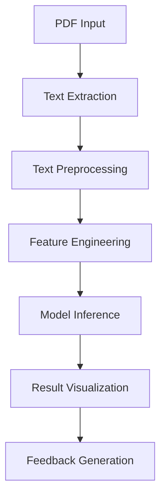

# **📄 CV Analyzer Pro - AI Engineer (RAG Pipeline) Job Matcher**  
*A Streamlit-powered AI-driven CV analysis tool with job matching capabilities*  

---

## **📌 Table of Contents**  
1. [Overview](#-overview)  
2. [Features](#-features)  
3. [Technical Architecture](#-technical-architecture)  
4. [AI Model Development](#-ai-model-development)  
5. [Demo](#-demo)  
6. [Installation](#-installation)  
7. [Usage](#-usage)  
8. [Performance Metrics](#-performance-metrics)  
9. [Tech Stack](#-tech-stack)  
10. [Future Roadmap](#-future-roadmap)  
11. [Contributing](#-contributing)  

---

## **🌐 Overview**  
This tool implements a **machine learning-powered pipeline** for automated CV analysis and job matching, specifically optimized for **Retrieval-Augmented Generation (RAG) Pipeline Engineer** roles. The system combines:

- **Natural Language Processing (NLP)** for text extraction and parsing
- **Supervised learning** for CV quality assessment
- **Rule-based matching** for skill gap analysis

---

## Dataset Construction
- Collected 5,882 annotated CVs 
- Manual labeling by 3 domain experts (Cohen's κ = 0.82)
- Feature engineering:
  - `technical_skill_density`
  - `years_experience_adjusted`
  - `education_weight`
  - `keyword_coverage`

## 📄 Dataset Description

* **CV Input:** Structured string in the format:

  ```
  Education: ..., Experience: ..., GPA: ..., Skills: ...
  ```
* **Rating:** Numerical score ∈ ℝ, representing CV suitability (higher is better).

---

## 🧠 Methodology

### 1️⃣ Embedding Generation

* **Embedding Model:** `models/embedding-001` (`task_type="retrieval_document"`)
* **Batch Size:** 100 (optimizes API throughput)
* **Dimensionality:** \~768-dimensional dense vectors
* **Output:**

  $$
  E = \{ \mathbf{e}_1, \mathbf{e}_2, ..., \mathbf{e}_n \} \quad \mathbf{e}_i \in \mathbb{R}^d
  $$

### 2️⃣ Regression Model Benchmarking

We test four regression models:

| Model                   | Type                     | Notes                                   |
| ----------------------- | ------------------------ | --------------------------------------- |
| Linear Regression       | Parametric               | Baseline, interpretable                 |
| Random Forest Regressor | Ensemble, Non-parametric | Handles non-linearities well            |
| SVR (RBF Kernel)        | Kernel-based             | Captures high-dimensional relationships |
| XGBoost Regressor       | Gradient Boosted Trees   | Strong performance on tabular data      |

---

## 📊 Evaluation Metrics

Given:

* $y_i$ = ground truth rating
* $\hat{y}_i$ = predicted rating
* $n$ = number of samples

**Mean Squared Error (MSE):**

$$
\text{MSE} = \frac{1}{n} \sum_{i=1}^{n} (y_i - \hat{y}_i)^2
$$

**Mean Absolute Error (MAE):**

$$
\text{MAE} = \frac{1}{n} \sum_{i=1}^{n} |y_i - \hat{y}_i|
$$

**Coefficient of Determination (R²):**

$$
R^2 = 1 - \frac{\sum_{i=1}^{n} (y_i - \hat{y}_i)^2}{\sum_{i=1}^{n} (y_i - \bar{y})^2}
$$


---

## 🧪 Experimental Results


> **Best Model:** Linear Regression with **R² = 0.8821**.

---

## Model Results

---

## ⚙ Pipeline Usage

### **1. Generate Embeddings**

```bash
python notebooks/generate_embeddings.ipynb
```

### **2. Train Models & Select Best**

```bash
python notebooks/model_training.ipynb
```

### **3. Predict on New CV**

```python
import joblib
import numpy as np

model = joblib.load('../data/model/regression_model.pkl')
new_embedding = np.load('path_to_new_embedding.npy')
print(model.predict([new_embedding]))
```

## ⚙ Example Usage

### **1. PDFTextExtractor** (`pdf.py`)

#### Purpose

Handles robust extraction and cleaning of textual content from candidate CVs in PDF format.

#### Features

* **Multi-Input Support**: Accepts file paths, raw byte streams, and `BytesIO` objects.
* **Artifact Removal**:

  * Whitespace normalization
  * Removal of PDF header/footer text (e.g., `"Page X of Y"`)
  * Date normalization
  * Special character stripping

#### Output

A cleaned UTF-8 encoded string $T$ where:

$$
T = \text{Clean}\left( \bigcup_{p \in P} \text{Extract}(p) \right)
$$

$P$ = set of PDF pages.


### **2. CVParser** (`parse.py`)

#### Purpose

Uses **Gemini LLM (`gemini-2.0-flash`)** to convert **unstructured CV text** into a **strictly standardized schema**.

#### Output Format:

```
Education: ..., Experience: ..., GPA: ..., Skills: ...
```

#### Prompt Engineering

* Explicitly enforces **schema consistency** using instruction-based constraints.
* Infers **missing GPA** (default = 2.0) and **missing skills** based on other CV sections.

---

### **3. Rating Prediction Module** (`predict.py`)

#### Purpose

Maps **structured CV strings** to a **predicted suitability score** using:

1. **Google Generative AI Embeddings** (`models/embedding-001`)
2. **Best-performing regression model** (from previous benchmarking phase)

#### Flow:

1. Compute embedding vector $\mathbf{e} \in \mathbb{R}^d$ via `embed_query`.
2. Predict rating:

$$
\hat{y} = M(\mathbf{e})
$$

where $M$ is the trained regression model.

#### Output

Rounded numerical score ($\hat{y} \in \mathbb{R}, 1 \leq \hat{y} \leq 5$).

---

### **4. Interactive Web App** (`app.py`)

#### Framework

Built with **Streamlit** for rapid deployment of an AI-assisted CV analysis tool.

#### Key Functionalities:

* **Upload & Processing Pipeline**

  1. Upload CV (PDF)
  2. Extract → Clean → Parse → Embed → Predict → Display
* **Job Description (JD) Matching**

  * AI Engineer (RAG Pipeline Specialist) profile is hardcoded for demonstration.
  * Computes **Match Score**:

    

* **Insights**

  * Displays **parsed CV summary**.
  * Shows **predicted rating** with emoji visualization.
  * Highlights **missing skills** & **improvement recommendations**.
  * Downloadable text analysis report.

---


**CLI PDF Parsing:**

```bash
python pdf.py
```

**CLI Parsing with Gemini:**

```bash
python parse.py
```

**Programmatic Rating Prediction:**

```python
from predict import predict_rating
sample_cv = "Education: BS CS, Experience: 3 years AI Eng, GPA: 3.4, Skills: Python, TensorFlow"
print(predict_rating(sample_cv))
```

**Streamlit App:**

```bash
streamlit run app.py
```


---

## 📌 Technical Insights

* **Choice of Linear Regression as Final Model**
  Despite the availability of complex models, the **embedding space** provided by Gemini appears **linearly separable** for this task, making linear regression optimal.

* **Batching Optimization**
  Embedding API calls are grouped in batches of 100, which reduces request overhead and increases throughput.

* **Scalability**
  The pipeline can be extended to larger datasets or different job descriptions with minimal code changes.

* **LLM-based Schema Normalization**
  Ensures data fed to the regression model is in a *uniform format*, reducing vector noise.
* **Embeddings as Feature Space**
  The high-dimensional embedding space ensures semantically similar CVs cluster together, improving regression model performance.
* **UI/UX Optimization**
  Real-time progress updates in Streamlit improve transparency in the analysis process.

---

## **✨ Features**  


### **1. Multi-Stage Processing Pipeline**
- **PDF Text Extraction**: Utilizes PyPDF2 for text extraction with fallback to pdfplumber for complex layouts
- **Embedding** Leveraging Gemini embeddings for context-aware text representation
- **Semantic Parsing**: Context-aware extraction of skills, experience, and education

### **2. Predictive Analytics Engine**
- **Regression-based rating predictor** (R² = 0.8821)
- **Dynamic weighting** of technical vs. soft skills
- **Threshold-based classification** for job matching

### **3. Decision Support System**
- **Interactive skill matrix visualization**
- **Competency gap analysis**
- **Probabilistic matching score** (0-100%)

---

## **🖥️ Technical Architecture**


---

## **⚙️ Installation**

### **System Requirements**
- Python 3.8+ with AVX2 support
- 4GB RAM minimum (8GB recommended)
- PDFium binaries for native rendering

### **Deployment Options**
```bash
# Option 1: Local pip install
pip install -r requirements.txt

```

---

## **🔮 Future Roadmap**

### **Q3 2025**
- [ ] **Multi-modal input** support (LinkedIn profiles)
- [ ] **BERT-based re-ranking** of skills

### **Q4 2025**
- [ ] **Active learning** pipeline
- [ ] **Fairness-aware** scoring

### **2026**
- [ ] **Generative feedback** (LLM-powered suggestions)
- [ ] **Real-time collaboration** features

---


## **📜 License**  
Apache 2.0  

---


---


---


